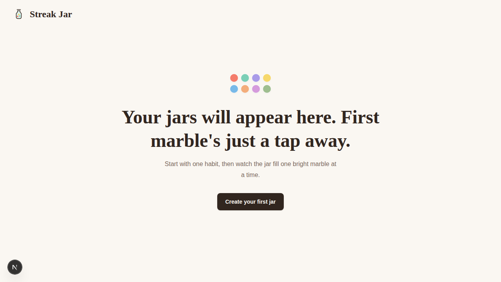

# QA Smoke Check — Home Page (#29)

**Verdict:** ✅ Pass — the Streak Jar home page renders in the browser.

## What was exercised
- Installed dependencies (`pnpm install`) and started the dev server (`pnpm dev`, port 5050).
- Navigated to the app home page and captured a full-page screenshot as evidence.

## Result
The home page renders correctly in its empty state (no jars yet):
- Header with the Streak Jar logo and wordmark.
- Marble color palette graphic.
- Heading: "Your jars will appear here. First marble's just a tap away."
- Supporting copy and a "Create your first jar" call-to-action.

Page title is `Streak Jar` and the route returns HTTP 200.

## Notes
- The app is configured for GitHub Pages with `basePath: "/streak-jar"` and
  `trailingSlash: true` (see `next.config.ts`), so the home page is served at
  `http://localhost:5050/streak-jar/`. Requests to `/` correctly 404 by design.
- One benign console error: `GET /favicon.ico 404` (no favicon is shipped). This
  has no functional impact on the home page.
